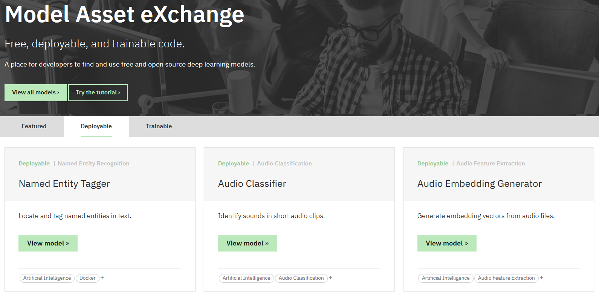

# Introduction to the Model Asset eXchange on IBM Developer

The [Model Asset eXchange](https://developer.ibm.com/exchanges/models/) (MAX) on IBM Developer is a place where you can find and use free open source deep learning models for text, image, audio, and video processing and much more. The curated list includes _deployable_ models, which you can run as a microservice locally or in the cloud on Docker or Kubernetes, and _trainable_ models.

By completing this introductory tutorial you will learn how to deploy a model microservice and consume it in a basic web application.

Tutorial modules:
 - [**Setup**](setup/) (Estimated time: 10 minutes)
 - [**Module 1: Run a deep learning microservice on Docker**](modules/module1) (Estimated time: 30 minutes) 
   - Run a microservice using a pre-built Docker image
   - Run a microservice using a custom-built Docker image
 - [**Module 2: Consume a deep learning microservice**](modules/module2/) (Estimated time: 20 minutes) 
   - Customize a sample Node.js or Python web app to consume a microservice

Related links:
 -  [MAX code patterns](http://ibm.biz/max-developers): Explore official sample applications that utilize MAX models, such as the [image caption generator](https://developer.ibm.com/patterns/create-a-web-app-to-interact-with-machine-learning-generated-image-captions/) or the [age estimator](https://developer.ibm.com/patterns/estimate-ages-for-detected-human-faces/).

 If you have any questions or feedback please [join the MAX community on Slack](https://join.slack.com/t/model-asset-exchange/shared_invite/enQtNDQ4OTQxODUyMTYwLWU2NTc4YTYxNjBhMWRlYWZkNTM5MjlkMDI4ZDI3YzQwMTYyZjk5YjU5NWU3MmNmN2FiNjg1MWFkYzQyODk3OTM).
 
 ---
 License: [Apache-2.0](LICENSE)
