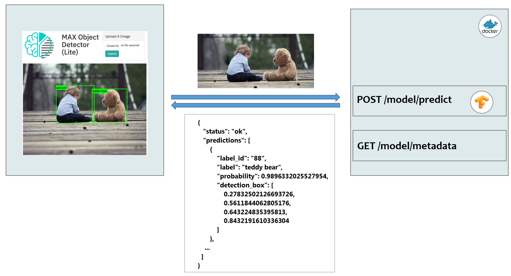
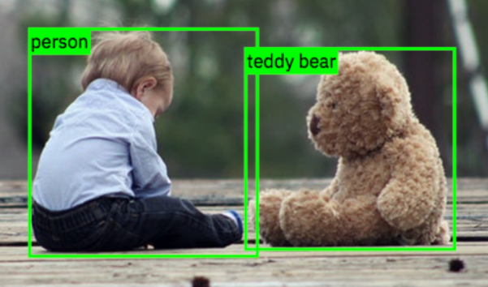

# Consume a MAX model asset

In the [previous module](/modules/module1) you've deployed a model serving microservice on Docker in a local environment and explored the service's API endpoints. 

In this module you will learn how to:
  * invoke the prediction endpoint of a model microservice, and 
  * process and visualize the results using a simple web application.

The following chart depicts the data flow between our sample web aplication (on the left) and the Object Detector model serving microservice:

  


## Setup

1. Ensure the model microservice is running by executing the following command in a terminal window.

   ```
   $ curl -i http://localhost:5000/model/metadata
   ```
   
   > If the command returns an error, start the microservice: 
   
   >  ```$ docker run -it -p 5000:5000 codait/max-object-detector```

In preparation for this workshop we have created simple Node.js and Python web application stubs that you will complete by adding the code required to invoke the model microservice's prediction endpoint and process and visualize the results.

Continue with the instructions for the programming language of your choice:
 * [Node.js](#consuming-using-nodejs)
 * [Python](#consuming-using-python)


---
## Consuming using Node.js
---

1. Clone the Node.js sample application repository
  
   ```
   $ git clone https://github.com/CODAIT/max-workshop-app-nodejs.git
    ...
   $ cd max-workshop-app-nodejs 
   ```
 
 2. Open `static/index.html`, `static/js/webapp.js`, and `app.js` in your favorite editor. 
 
    * `static/index.html` implements a simple web UI, providing users with the ability to select a PNG/JPG image from their local file system. 
    * `static/js/webapp.js` contains Javascript code that invokes the model microservice's prediction endpoint `/model/predict`, parses the results, and draws annotated bounding boxes around detected objects.
    
    * `app.js` implements a simple [Express](https://expressjs.com)-based web server that serves the static application content (web pages, javascript, style sheets, etc) and redirects requests to the model microservice.
 
 3. In `static/js/webapp.js`
    * Locate `TODO R1` and review the prediction request payload. The model you are using requires a PNG/JPG encoded _image_ file as input and accepts a threshold as optional input. The _threshold_ acts as a filter, removing detected objects from the result set that the model is less certain about. In this sample application we are overriding the default (0.7) for illustrative purposes with a lower value.
    * Locate `TODO T1` and replace the `**TODO**` placeholder with your microservice's prediction endpoint `/model/predict`.
    * Locate `TODO T2` and replace the `**TODO**` placeholder with your microservice's prediction request method `POST`.
    * Save your changes.
 
    > Note: Remember you can always review the Swagger specification for the supported model endpoints by opening the microservice URL (e.g. `http://localhost:5000/`) in a web browser.
 
 4. Install the prerequisites and launch the application.
 
    ```
    $ npm install
    $ npm start
    ```
 
 5. Open http://localhost:8090/ in your web browser.
    * In Safari: Open the _Network_ tab in the _Web Inspector_ (MacOS: &lt;option&gt;&lt;command&gt;&lt;i&gt;).
    * In Google Chrome: Open the _Network_ tab in the _Developer Tools_ (MacOS: &lt;option&gt;&lt;command&gt;&lt;i&gt;).
    * In Mozilla Firefox: Open the _Network_ tab in the _Web Developer Tools_ (MacOS: &lt;option&gt;&lt;command&gt;&lt;i&gt;).
 
 6. Choose a sample image from the `assets/` directory (or any other PNG/JPG image you might have stored on your machine) and click **Detect Objects**.
 
    If you've defined the endpoint URL and request method properly, a message is displayed indicating that no objects were detected. This is expected because you have not yet customized the code that processes the microservice response.
    
 7. In your browser's _Network_ tab inspect the response of your prediction request. It should look similar to this:
  ```
   {
    "status": "ok",
    "predictions": [
        {
            "label_id": "88",
            "label": "teddy bear",
            "probability": 0.9896332025527954,
            "detection_box": [
                0.27832502126693726,
                0.5611844062805176,
                0.643224835395813,
                0.8432191610336304
            ]
        },
        {
            "label_id": "1",
            "label": "person",
            "probability": 0.9879012107849121,
            "detection_box": [
                0.24251864850521088,
                0.26926863193511963,
                0.6558930277824402,
                0.5768759846687317
            ]
        }
    ]
   }
  ```
  
  The `predictions` array contains an entry for each detected object, identifying:
  
   * the object `label` (e.g. _person_, _dog_, _cat_),
   * the confidence (`probability`) that the detected object represents the specified label (1 = high confidence, 0 = low confidence), and
   * the coordinates (y_1, x_1, y_2, x_2) of a rectangle that encloses the detected object.
 
 8. In `static/js/webapp.js`
    * Locate `TODO T3` and replace the `**TODO**` placeholder with `predictions`.
    * Save your changes.
    
 9. Reload http://localhost:8090/ in your web browser and try to detect objects again. 
 
    The application should display bounding boxes around detected objects along with the label.
    
    
   
---
## Consuming using Python
---

1. Clone the Python sample application repository in a terminal window.
  
   ```
   $ git clone https://github.com/CODAIT/max-workshop-app-python.git
    ...
   $ cd max-workshop-app-python  
   ```
   
 2. Open `app.py` in your favorite editor. 
    
    The application implements a simple [Flask](http://flask.pocoo.org)-based web server that serves the static application content (web pages, style sheets, etc) and invokes the model microservice's prediction endpoint.
 
 3. In `app.py`
    * Locate `TODO R1` and review the prediction request payload. The model you are using requires a PNG/JPG encoded _image_ file as input and accepts a _threshold_ as optional input. The threshold acts as a filter, removing detected objects from the result set that the model is less certain about. In this sample application we are overriding the default (0.7) for illustrative purposes with a lower value.
    * Locate `TODO T1` and replace the `**TODO**` placeholder with your microservice's prediction endpoint `/model/predict`.
    * Save your changes.
 
    > Note: Remember you can always review the Swagger specification for the supported model endpoints by opening the microservice URL (e.g. `http://localhost:5000/`) in a web browser.
 
 4. Install the prerequisites and launch the application in the terminal window.
 
    ```
    $ pip install -r requirements.txt
    $ python app.py
    ```
    
 5. Open http://localhost:8090/ in your web browser.
 
 6. Choose a sample image from the `assets/` directory (or any other PNG/JPG image you might have stored on your machine) and click **Detect Objects**.
 
    If you've defined the endpoint URL and request method properly, a message is displayed indicating that no objects were detected. This is expected because you have not yet customized the code that processes the microservice response.
    
 7. Inspect the application's debug output. It should look similar to this:
  ```
   {
    "status": "ok",
    "predictions": [
        {
            "label_id": "88",
            "label": "teddy bear",
            "probability": 0.9896332025527954,
            "detection_box": [
                0.27832502126693726,
                0.5611844062805176,
                0.643224835395813,
                0.8432191610336304
            ]
        },
        {
            "label_id": "1",
            "label": "person",
            "probability": 0.9879012107849121,
            "detection_box": [
                0.24251864850521088,
                0.26926863193511963,
                0.6558930277824402,
                0.5768759846687317
            ]
        }
    ]
   }
  ```
  
  The `predictions` array contains an entry for each detected object, identifying:
  
   * the object `label` (e.g. _person_, _dog_, _cat_),
   * the confidence (`probability`) that the detected object represents the specified label (1 = high confidence, 0 = low confidence), and
   * the coordinates (y_1, x_1, y_2, x_2) of a rectangle that encloses the detected object.
 
 8. In `app.py`
    * Locate `TODO T2`, uncomment the next line and replace the `**TODO**` placeholder with `predictions`.
    * Save your changes.
    
 9. Reload http://localhost:8090/ in your web browser and try to detect objects again. 
 
    The application should display bounding boxes around detected objects along with the label.
    
    


## Summary

In this module you
  * added code to invoke a deep learning model prediction endpoint, and
  * processed and visualized the response.

End of module
